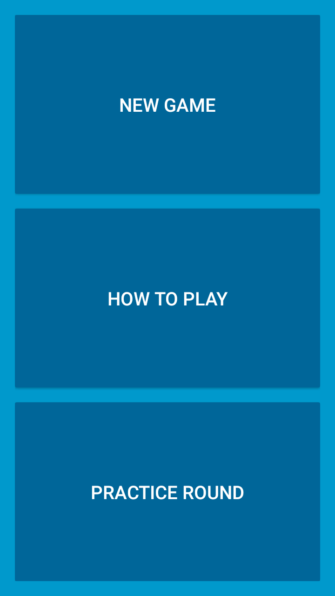
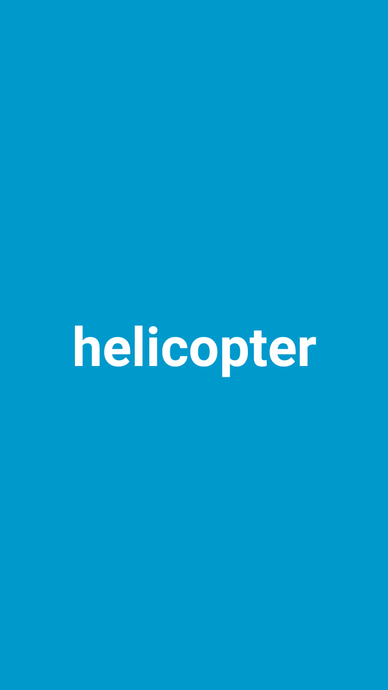

# Catch The Phrase

<h2>Overview</h2>
Catch the Phrase is a hot potato word game for two teams. When the game begins, a timer will start and the app will display one clue at a time. The player holding the app device must
describe the clue until their teammates successfully guess it. Then, the device will be passed to a player on the opposite team and this process will repeat with a new clue. To advance
to the next clue, the screen may be tapped or swiped. When the timer runs out, the "timeup" sound will play, and the team not holding the device will be awarded a point. The first team
to score 7 points wins.

<h2>Rules</h2>
<b>When describing a clue, a player must NOT:</b>
<ul>
<li>Say what letter it starts with</li>
<li>Say what words it rhymes with</li>
<li>Say how many syllables it has</li>
<li>Say a word in the clue (e.g. "holy" in "holy cow!")</li>
</ul>
     
<b>When describing a clue, a player MAY:</b>
<ul>   
<li>Use body language and physical gestures</li>
<li>Use synonyms, so long as they don't rhyme with the clue</li>
</ul>

<h2>Screenshots</h2>

